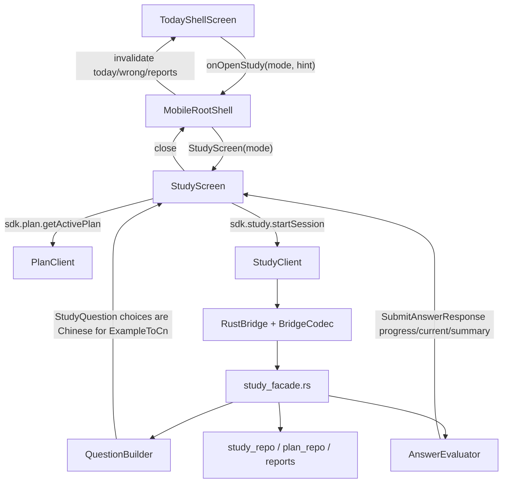

# Flutter 源码函数级迁移图谱

本文档用于把 `apps/flutter_mobile` 的现有 Flutter 实现拆成可迁移依据，避免小程序侧继续按截图表面重写。迁移原则是：业务生成、题库抽取、判定、计划覆盖、报告数据都以现有 Flutter 调用链和 Rust/SDK 来源为准；Taro 只复刻 Flutter 前端包装与交互。

## 先纠正的事实

- Flutter/Rust 没有“根据英文例句选择英文释义”这个模式。`ExampleToCnChoice` 和 `ExampleToCnChoiceNoTranslation` 都是“根据英文例句选择中文释义”：题干展示英文例句，选项文本来自中文释义，提交值是选项标签 `A/B/C/D`。
- Flutter 侧的 Croc BTI 人格名称、文案、形象、题目都是现成源码：`apps/flutter_mobile/lib/features/croc_bti_model.dart` 与 `apps/flutter_mobile/assets/croc_bti/*`。
- 学习页右侧五个操作不是文字按钮，Flutter 用 Material Icons：`lightbulb_outline`、`mode_comment_outlined`、`visibility_outlined`、`gavel_outlined`、`delete_outline`。
- 底栏也不是 bitmap 图：Flutter 用 Material Icons：`today/today_outlined`、`tune/tune_outlined`、`menu_book/menu_book_outlined`、`query_stats/query_stats_outlined`、`auto_awesome/auto_awesome_outlined`。小程序侧需要找等价 iconfont/SVG，不能用随意抽象符号。
- 学习页单击选中、双击提交。Flutter 的 `_buildChoiceOptions` 里 `onTap` 只更新 `_selectedChoice`，`onDoubleTap` 才调用提交；题号推进必须来自后端 `submitAnswer` 返回，不允许点一下本地自增。

## 资源来源

- Croc BTI 形象：`apps/flutter_mobile/assets/croc_bti/`
  - `scroll_master_croc.png` 对应 `VINA 鳄卷师`
  - `cavalry_croc.png` 对应 `VINT 鳄骑兵`
  - `stele_croc.png` 对应 `VIRA 鳄碑`
  - `armor_guard_croc.png` 对应 `VIRT 鳄甲卫`
  - `chanter_croc.png` 对应 `VONA 鳄咏者`
  - `swordsman_croc.png` 对应 `VONT 鳄剑士`
  - `classic_croc.png` 对应 `VORA 古风小鳄`
  - `forgemaster_croc.png` 对应 `VORT 鳄铸师`
  - `book_guest_bu_e_ke.png` 对应 `CINA 不鳄客`
  - `ranger_croc.jpg` 对应 `CINT 鳄游侠`
  - `hermit_croc.png` 对应 `CIRA 鳄隐士`
  - `alligator_jade.png` 对应 `CIRT 全员鳄玉`
  - `bard_croc.jpg` 对应 `CONA 吟游鳄`
  - `battle_mage_pencil_croc.png` 对应 `CONT 鳄笔`
  - `stargazer_croc.jpg` 对应 `CORA 观星鳄`
  - `correction_officer_croc.jpg` 对应 `CORT 鳄刑官`
- 加载/刷新动画：`apps/flutter_mobile/assets/crocodile/roll/*`、`apps/flutter_mobile/assets/crocodile/crawl/*`。
- 奖励图片：`apps/flutter_mobile/assets/rewards/manifest.json` 与 `images/`、`webp_q60_540/`。

## 业务来源总览

## Flutter Dart 文件函数图谱

### `apps/flutter_mobile/lib/main.dart`

- `main()`：初始化 Flutter binding，并启动 `MyApp`。
- `MyApp.build()`：挂载 `_ThemeRoot`，给应用注入 `WordMobileSdk`。
- `_ThemeRootState.initState()` / `dispose()`：创建并释放 `ThemeSettingsController`。
- `_ThemeRootState.build()`：通过 `AnimatedBuilder` 响应主题变化。
- `_AppRootState.initState()`：创建 `AppState`，启动初始化流程。
- `_AppRootState._initialize()`：初始化本地/Rust/账号状态，决定进入启动、引导或主壳。
- `_AppRootState._attachAuthRecoveryListener()`：绑定 Supabase 密码恢复深链监听。
- `_AppRootState._openPasswordReset()`：打开密码重设界面。
- `_AppRootState.build()`：根据 `AppState` 状态切换 `OnboardingFlow`、`MobileRootShell`、loading、错误页。
- `_BootstrapLoadingScreen.build()`：启动加载页。
- `_StartupErrorScreen.build()`：启动失败重试页。

### `apps/flutter_mobile/lib/bridge/*`

- `BridgeCodec.encodeRequest()`：把 Dart 请求编码为 JSON 字符串。
- `BridgeCodec.decodeResponse()`：把 Rust 返回 JSON 解码成 `Map<String, dynamic>`。
- `BridgeCodec.decodeDynamicResponse()`：解码动态返回值。
- `BridgeCodec.decodeVoidResponse()`：处理无返回值命令。
- `BridgeError.fromNative()`：把 native/Rust 错误字符串解析成分层错误。
- `BridgeError.userMessage`：把错误种类转换为用户可读文案。
- `RustBridge.initialize()`：初始化 native bridge。
- `RustBridge.call()`：通过 MethodChannel 调用 Rust 方法并返回字符串。
- `RustBridge.callVoid()`：调用无返回命令。
- `RustBridge.isAvailable()`：检测 Rust bridge 是否可用。

### `apps/flutter_mobile/lib/sdk/sdk.dart`

- `WordMobileSdk`：聚合所有 feature client，Flutter 页面永远通过它访问业务能力。
- `WordMobileSdk.defaultInstance()`：创建默认 `RustBridge`/`BridgeCodec` 组合。
- 迁移含义：小程序版接口层应保留同名语义客户端，不能在页面里拼业务规则。

### `apps/flutter_mobile/lib/sdk/study_client.dart`

- `StudyClient.startSession()`：发起 `startStudySession`，参数包括 `mode`、`entrySourceIds`、`entryPayloads`、`distractorPayloads`、`questionTypeWeights`。
- `StudyClient.submitAnswer()`：提交 `questionId`、`response`、`responseTimeMs`，返回判定、下一题、进度、summary。
- `StudyClient.completeSession()`：结束当前 session 并取 summary。
- `StudyClient.cancelSession()`：取消当前 session。
- `StudyClient.getActiveSession()`：读取当前活动 session。
- `StudyClient.getResumeSessionHint()`：读取今天可恢复学习提示。
- `StudyClient.acceptDisputedMeaning()`：争议释义通过后把当前结果改为正确。
- `StudyClient.markEntryMastered()`：标记当前词条已掌握，并剪掉该词未答题。
- `StudyQuestion` / `SubmitAnswerResponse` / `StartSessionResponse` 等模型：把 Rust camelCase payload 映射为 Flutter 对象。
- 迁移含义：答题推进、判定、完成度不能在 Taro 本地模拟，必须以这些响应字段为准。

### `apps/flutter_mobile/lib/features/study_screen.dart`

- `StudyScreen`：抖音式学习页入口，接收 `sdk`、`mode`、`resumeHint`、关闭回调和切换学习模式回调。
- `_StudyScreenState.initState()`：初始化 controller 并启动 `_start()`。
- `_start()`：清空本地输入，调用 `_startWithBestAvailableSeed()`，写入 `_session`。
- `_startWithBestAvailableSeed()`：先读 `sdk.plan.getActivePlan()`，再调用 `sdk.study.startSession()`；如果不是 resume，就把计划里的 `questionTypeWeightsByMode` 按当前 mode 传给 Rust。
- `_submit()`：收敛 `explicitResponse`、`_selectedChoice`、输入框文本，调用 `sdk.study.submitAnswer()`；用返回的 `currentQuestion/progress/answeredQuestions/summary` 更新页面。
- `_markCurrentEntryMastered()`：调用 `sdk.study.markEntryMastered()`，后端剪掉当前词剩余未答题，前端用返回进度同步。
- `_revealCurrentAnswer()`：提交空答案，触发 skipped/incorrect 反馈。
- `_acceptDispute()`：仅在可争议的非选择题错误答案上调用 `acceptDisputedMeaning()`，并同步云端争议记录。
- `_maybeShowHintPrompt()` / `_showHintBottomSheet()`：错误后或有提示时展示 hint。
- `_advance()` / `_skip()` / `_complete()` / `_cancel()` / `_showExitOptions()`：处理页面流转、跳过、结束、取消、退出。
- `_returnToTodayKeepingProgress()`：回今日页但保留后端进度。
- `_feedItems`：把已答题、当前题、完成页合成竖向 feed；避免当前答题历史丢失。
- `_buildFeedScaffold()`：`PageView.builder` 纵向滚动；顶部 home/progress/close 叠层；隐藏底栏。
- `_StudyFeedPage.build()`：具体题页布局，背景 `0xFFF9FAF7`，主体左侧大字号题干，右侧操作栏固定在屏幕中段。
- `_RoundActionButton`：圆形透明操作按钮，用 Flutter Material Icon，不是文字。
- `_FeedQuestionHeader`：根据题型决定 hero 展示，`word` 题显示大词头、词性、音标。
- `_QuestionComposer`：组合例句、翻译、选择题/输入题、反馈区。
- `_buildChoiceOptions()`：遍历 `question.choices`，单击只选中，双击才提交；提交值是 `_choiceDisplay(...).value`，也就是标签。
- `_choiceDisplay()`：从 `choice['label']` / fallback A-D 得到 value，从 `choice['text']` 得到展示文案。
- `_choiceState()` / `_isCorrectChoice()` / `_resolvedCorrectChoiceTextToken()`：答后判断选项样式，优先用正确答案文本与 choice 文本匹配，避免 stale `A` 标签误判。
- `_HighlightedExampleSentence`：把例句里的目标词高亮。
- `_questionLabel()`：题型中文标签；`exampleToCnChoiceNoTranslation` 明确是“根据英文例句选择中文释义”。
- `_StudyCompletionFeedPage` / `_StudyCompletion` / `_SummaryGrid` / `_AccuracyPanel` / `_WrongWordsPanel`：完成页、统计卡、错词总结。
- `_canDisputeAnsweredQuestion()`：限制争议功能只出现在合理场景。

联合解决的问题：

- 学习链路启动：`TodayShellScreen._openStudy` -> `MobileRootShell._openStudy` -> `StudyScreen._startWithBestAvailableSeed` -> `StudyClient.startSession` -> Rust `start_study_session`。
- 题号推进：只能由 `_submit()` 接收 `SubmitAnswerResponse.progress` 后更新，不能本地自增。
- 选择题提交：`_buildChoiceOptions` 单击选中、双击提交标签；Rust 用标签判定。
- 答案反馈：`SubmitAnswerResponse.result` 进入 `_choiceState` / feedback 组件，正确/错误/跳过由后端 outcome 决定。
- 已掌握：`_markCurrentEntryMastered` 联动 Rust 剪枝，避免只在前端隐藏。

### `apps/flutter_mobile/lib/features/mobile_root_shell.dart`

- `RootRouteInventoryEntry`：声明主壳路由能力，包括 today、plan、wrong、reports、ai、study、accountDrawer、leaderboard、settings、crocBti 等。
- `_bodyIndex`：如果 `_showingStudy` 为 true，`IndexedStack` 切到 Study 页。
- `_switchToMain()`：主 tab 切换，并根据页面刷新 seed 失效缓存。
- `_openStudy()`：保存 mode/resumeHint，设置 `_showingStudy=true`。
- `_handleStudyClosed()`：从 Study 返回 Today，刷新 today/wrong/reports 缓存。
- `_openAccountDrawer()`：打开右侧账号抽屉。
- `_openLeaderboard()`：从抽屉进入排行榜。
- `_openCrocBti()`：从抽屉进入 Croc BTI，返回 applied 后刷新计划/今日。
- `build()`：用 `IndexedStack` 承载 Today、Plan、Wrong、Reports、AI、Study；Study 显示时隐藏底部 `NavigationBar`。
- `NavigationDestination`：底栏图标来自 Material Icons，标签为“今日/计划/错词/报告/AI”。小程序当前不做 AI 时应隐藏或跳过 AI 入口，而不是保留空页。

### `apps/flutter_mobile/lib/features/today_shell_screen.dart`

- `_refreshHomeBundle()`：并发/顺序读取今日状态、resume hint、奖励、报告摘要等首页 bundle。
- `_optionalLoad()`：容错读取可选模块，避免局部失败拖垮首页。
- `_openStudy()`：把具体 mode 与 resume hint 传给 shell。
- `_applyPlanToToday()`：把当前计划同步为今天任务。
- `_snapshotOrPlanFallback()`：没有今日快照时用 active plan 兜底展示。
- `_calculateCompletion()`：从实际任务进度计算今日完成度；不能无答题显示 40%。
- `_buildTaskItems()` / `_displayTarget()` / `_planTarget()` / `_intValue()`：把后端 today state 和 plan targets 转成今日任务行。
- `_PrimaryActionCard`：紫色主卡，含日期、任务标题、说明、进度条、完成度、剩余任务单位、进入学习按钮。
- `_TaskBreakdownCard` / `_TaskProgressRow`：今日任务拆解卡，四类任务颜色、进度、箭头入口都来自真实 state。
- `_RewardSlotMachineCard`：奖励抽取卡。
- `_SyncStatusSummary`：同步状态卡。
- AI 相关卡片：小程序当前版本应跳过。

联合解决的问题：

- 今日完成度必须从 `today.getTodayHomeState` / session progress / completed session 结果来，不能用静态 mock。
- 今日任务入口必须传对应 mode：新词 `newWord`，复习 `review`，混合 `mixedTest`，错词 `wrongWordReinforcement`。

### `apps/flutter_mobile/lib/features/plan_screen.dart`

- `_load()`：读取 active plan。
- `_hydrateControllers()`：把计划名、每日数量、增长规则、词书选择灌入 UI controller。
- `_buildPlanInput()`：把 UI 当前值组装为 plan input。
- `_persistPlanAndWordbook()`：保存计划与词书选择。
- `_save()`：保存但不一定应用到今日。
- `_applyToToday()`：把计划覆盖到今日任务。
- `_toggleWordbook()`：切换词书。
- `_showTodayApplyDialog()`：保存后询问是否同步今日。
- `_PlanHeroCard`：顶部紫色计划摘要卡。
- `_RuleEditorCard`：增长规则编辑区。
- `_StepperField`：数字步进器，Flutter 用减号/加号按钮。
- `_ModeToggleChip`：全部共享/分别设置切换。
- `_SectionCard` / `_InfoPill`：统一卡片和统计 pill。

联合解决的问题：

- 计划修改不是只改 UI 数字；`_buildPlanInput` -> `PlanClient.updateActivePlan` -> `_applyToToday` 才完成覆盖。
- Croc BTI 应用计划时也复用相同 plan payload，包括 `questionTypeWeightsByMode`。

### `apps/flutter_mobile/lib/features/reports_screen.dart`

- `_load()`：调用 `sdk.reports.getReportsOverview()`，设置最新日期和默认模式。
- `_modeLabel()`：将 mode 转为中文显示。
- `_modeColor()`：各模式颜色：新词绿、复习蓝、混测橙、错词红、词根紫。
- `_DailyLineChart.build()`：折线图组件。关键尺寸：`stepX=56`、`leftGutter=34`、`rightGutter=18`、`topGutter=12`、`bottomGutter=22`、普通高度 `140`、compact 高度 `104`。
- `_DailyLineChart` 中每个点外包 `GestureDetector(onTap: () => onSelect(point.item))`，点击点要更新选中日期并展示当日分析。
- `_SelectedDailySummary`：非 compact 时显示选中日期、正确率、题量、时长。
- `_ModeBreakdownCard`：模式卡片，点击展开/收起该模式自己的趋势图。
- `_LineChartPainter.paint()`：画网格、折线、点、选中态。
- `_LineChartPainter.shouldRepaint()`：points 或颜色变化才重绘。
- `_formatDurationMs()`：毫秒转 `s/min` 文案。
- `_metricValue()`：统计值读取兜底。

联合解决的问题：

- 报告数据来自 `ReportsClient.getReportsOverview`，不是前端写死。
- 图表必须有点选交互，选中后卡片显示该日期细节；模式卡点击后展开 compact 图。

### `apps/flutter_mobile/lib/features/wrong_words_screen.dart`

- `_load()`：读取错词列表与统计。
- `_selectFilter()`：切换全部、高优先级、最近错误、高频出错。
- `_loadDetail()`：点选词条后读取详情。
- `_startReinforcement()`：按当前筛选进入错词强化学习。
- `_WrongWordHero`：紫色统计总览卡。
- `_FilterCard`：筛选按钮卡。
- `_ReinforcementCard`：错词强化入口。
- `_WrongWordList` / `_WrongWordTile`：错词列表，展示单词、音标、中文、次数、优先级。
- `_WrongWordDetail`：展开详情，展示 hint、最近错误、例句、词根词缀信息。

联合解决的问题：

- 错词页不是简单列表；筛选结果会影响强化入口，详情与历史记录来自后端 wrong words client。

### `apps/flutter_mobile/lib/features/croc_bti_model.dart`

- `CrocBtiQuestion`：定义题目 id、轴、题干、正向 trait。
- `CrocBtiAxisScore`：保存每个维度得分、选中 trait。
- `CrocBtiResult`：保存人格 code、title、summary、advice、assetPath、flavor、axisScores、模式权重、计划输入、题型权重。
- `crocBtiQuestions`：完整题库，不能在小程序重新编造。
- `_profiles`：人格中文名、summary、advice。
- `_profileVisuals`：人格形象资源和 flavor 文案。
- `evaluateCrocBti()`：按四个轴算 code，再取 `_profiles/_profileVisuals`，生成计划权重与题型权重。
- `loadSavedCrocBtiAnswers()`：按用户 scope 从 SharedPreferences 读取答案，并过滤非法题 id。
- `saveCrocBtiAnswers()`：只保存合法题 id 与 1/2/3 答案。
- `clearSavedCrocBtiAnswers()`：清空答案。
- `hasCompleteCrocBtiAnswers()`：判断所有题是否都有答案。未答题不应默认选 3。
- `loadSavedCrocBtiDailyMinutes()` / `saveCrocBtiDailyMinutes()`：保存每日学习分钟，范围 10-240。
- `crocBtiPlanInputFor()`：把 result 与当前 plan 合成可保存计划 payload。
- `crocBtiPlanInputForDailyMinutes()`：根据分钟数换算每日任务量。
- `normalizeCrocBtiQuestionTypeWeightsByMode()`：标准化各模式题型权重。
- `calculateCrocBtiQuestionTypeWeights()`：按人格 code 生成各模式题型权重。
- `calculateCrocBtiWeights()`：根据 trait 生成 new/review/mixed/wrong/root 比例。
- `weightsToPlanInput()`：把比例转为计划任务数量。
- `_applyQuestionTypeDeltas()`：按 trait 调整题型偏好。
- `_scoreAxis()`：单轴评分，正向题加分，反向题减分。
- `_normalizeWeights()`：权重归一化。

联合解决的问题：

- BTI 结果、形象、题目、计划权重、题型权重全部由这个文件联合生成；小程序要直接迁移这些常量和算法。
- “查看结果”必须先满足 `hasCompleteCrocBtiAnswers`，否则提示未完成；不能默认选择 3。

### `apps/flutter_mobile/lib/features/croc_bti_screen.dart`

- `_loadInitialState()`：读取已保存答案、分钟、active plan，恢复可编辑状态。
- `_loadPlan()`：读取当前计划。
- `_ensureEditableState()`：如果已有结果，允许继续编辑计划/权重。
- `_updateDailyLearningMinutes()`：滑动每日分钟并重算计划输入。
- `_updatePlanInput()`：调整每日任务数量。
- `_updateQuestionTypeWeight()`：调整某模式下的题型权重。
- `_applyResult()`：把 Croc BTI 计划 payload 保存并应用到今日。
- `_profilePayload()`：生成保存 profile 的结构化字段。
- `_QuestionView`：题目列表/结果切换。
- `_QuestionCard`：每题 1/2/3 segmented 选择。
- `_DailyMinutesQuestionCard`：每日分钟 slider。
- `_ResultView`：人格结果页，展示图片、title、summary、advice、计划编辑入口。
- `_PlanInputCard` / `_PlanCountSlider`：计划题量调整。
- `_QuestionTypeWeightsCard` / `_ModeQuestionTypeEditor` / `_QuestionTypeSlider`：按模式编辑题型权重。
- `_rebalanceQuestionTypeWeights()`：一个题型变化后重新平衡同组权重。

### `apps/flutter_mobile/lib/features/account_drawer.dart`

- `_openAuth()`：打开登录/注册。
- `_openProfileInfo()`：打开个人信息。
- `_openSettings()`：打开设置。
- `_checkUpdates()`：触发更新检查。
- `_openOnboarding()`：打开新手引导。
- `_openCrocBti()`：打开 Croc BTI。
- `_signOut()`：退出登录但保留本机学习数据。
- `_phaseText()`：账号状态文案。
- `_profileName()`：用邮箱推导默认昵称。
- `_avatarChild()` / `_avatarImageProvider()`：头像显示。
- `_OnboardingTile` / `_CrocBtiTile` / `_CheckUpdatesTile`：抽屉动作入口。

迁移含义：账号、排行榜、Croc BTI、设置不是底栏页面，而是侧边抽屉动作。

### `apps/flutter_mobile/lib/features/leaderboard_screen.dart`

- 读取排行榜 service，按 weekly/monthly/all-time 等维度展示。
- Flutter 当前把它作为抽屉入口页面，不在底栏。
- 小程序先接真实后端时，入口位置应跟抽屉保持一致。

### `apps/flutter_mobile/lib/features/profile_settings_screen.dart`

- 读取并保存昵称、头像等本地 profile。
- 头像图片影响 `MobileRootShell` 顶部账号按钮和 `AccountDrawer` 头部。

### `apps/flutter_mobile/lib/features/settings_screen.dart`

- 处理主题和偏好设置。
- 与 `theme_settings.dart` 的 controller 联动。

### `apps/flutter_mobile/lib/features/theme_settings.dart`

- `ThemeSettingsController`：读写主题偏好并通知 UI。
- `LocalProfileSettings`：保存本地头像/昵称等展示偏好。

### `apps/flutter_mobile/lib/features/shell_page_data_cache.dart`

- `ShellPageDataScope`：定义 today/plan/wrong/reports 等缓存域。
- `ShellPageDataCache.invalidate()`：学习完成或计划变更后刷新对应页面。
- 迁移含义：Taro 页面切换不能一直复用旧数据，学习关闭后要刷新 today/wrong/reports。

### `apps/flutter_mobile/lib/features/onboarding_flow.dart`

- 新手引导流程，最终写入本地状态。
- 抽屉中“新手引导”会重放这个流程。

### `apps/flutter_mobile/lib/features/auth_screen.dart`

- 登录、注册、邮箱验证、重置密码 UI。
- 目前 Flutter 侧是邮箱/Supabase 或 Word Admin；小程序新增微信登录时不要破坏原邮箱链路。

### `apps/flutter_mobile/lib/features/app_update_gate.dart`

- 检查版本与更新状态。
- 抽屉里的 check updates 会触发相同 service。

### `apps/flutter_mobile/lib/features/ai_screen.dart`

- AI 短文、错词导入、历史等 UI。小程序首版明确跳过 AI，迁移时只保留“不要接入”的记录。

### `apps/flutter_mobile/lib/features/sample_study_payloads.dart`

- 测试/演示用 study payload。
- 小程序正式学习链路不能把它当真实题库来源。

## Rust/核心业务函数图谱

### `crates/storage-core/src/models/study_question.rs`

- `QuestionType`：题型枚举。包含 `EnToCnChoice`、`ExampleToCnChoice`、`CnToEnChoice`、`EnToCnInput`、`ExampleToCnChoiceNoTranslation`、`WordSkeletonInput`、`RootToGlossInput`、`GlossToRootInput`。
- `QuestionType.is_input_type()`：判断输入题。
- `QuestionType.is_choice_type()`：选择题为非输入题。
- `QuestionType.all_four()`：新词固定四轮题型：例句选中文、英选中、中选英、英到中输入。
- `ChoiceOption`：选择题选项，字段 `text` 和 `label`。
- `StudyQuestion`：权威题目结构，包含 `word`、`pos`、`phonetic`、`prompt`、`accepted_meanings`、`example_sentence`、`example_translation`、`choices`、`correct_choice_label`、题号和总题数。

### `crates/storage-core/src/models/study_answer.rs`

- `StudyAnswer`：提交答案，包含 `question_id`、`response`、`response_time_ms`。
- `AnswerOutcome.is_positive()`：正确/模糊正确算正向。
- `AnswerOutcome.is_clear_failure()`：错误/跳过算明确失败。
- `AnswerOutcome.wrong_word_weight()`：错词权重。
- `AnswerOutcome.enters_wrong_pool()`：错误和跳过进入错词池。

### `crates/storage-core/src/models/study_requests.rs`

- `StartSessionEntryPayload`：前端/后端传给 Rust 生成题目的词条 payload。
- `QuestionTypeWeight`：Croc/计划传入的题型权重。
- `StartSessionRequest`：启动学习 session 的请求。
- `StartSessionResponse`：返回 session、当前题、进度、已答题。
- `SubmitAnswerRequest`：提交当前题。
- `SubmitAnswerResponse`：返回 result、isComplete、下一题、summary、nextAction、progress、answeredQuestions。
- `AcceptDisputedMeaningRequest/Response`：争议释义处理。
- `MarkStudyEntryMasteredRequest/Response`：已掌握剪枝处理。
- `SessionProgress`：`current/total` 是前端题号和完成度唯一来源。

### `crates/study-core/src/question_builder.rs`

- `QuestionBuilder::build_session_questions()`：按 mode、词条、干扰词、session id、题型权重生成完整题组。
- `build_root_affix_questions()`：词根词缀模式专用题组，不受个性化权重影响。
- `build_loop_questions()`：新词/复习四轮循环；新词固定先例句选中文，再英选中、中选英、输入，不吃 Croc 个性化题型权重。
- `build_weighted_pool_questions()`：混测/错词等模式按权重抽题型。
- `question_type_sequence_for_count()`：根据题量和权重展开题型序列。
- `build_single_question_with_used()`：为一个词和题型构建题目，并记录已用题。
- `build_cn_choices()`：为英选中/例句选中文构造中文选项。
- `build_en_choices()`：为中选英构造英文选项。
- `choice_meanings_for_word()`：提取目标词可用中文释义。
- `sanitize_choice_text()`：清洗选项文本，去掉嵌入的 A/B/C 标签、占位、斜杠伪释义等。
- `correct_choice_label`：由生成后的真实选项位置决定，不能假设 A 正确。
- `ExampleToCnChoice`：`prompt/example_sentence` 为英文例句，`example_translation` 展示中文翻译，`accepted_meanings` 为该例句对应中文释义，`choices.text` 为中文。
- `ExampleToCnChoiceNoTranslation`：同样中文选项，但隐藏 `example_translation`。
- 测试覆盖：例句题不使用不同释义的例句、选项清洗、干扰项去重、非 A 正确标签、新词固定四轮、root-affix 忽略个性化权重。

### `crates/study-core/src/answer_evaluator.rs`

- `AnswerEvaluator::evaluate()`：根据题型分派到选择题或输入题判定，生成 `StudyResult`。
- `evaluate_choice()`：选择题只接受标签，不能提交选项文本当作正确。
- `resolved_choice_label()`：优先用 choice 文本匹配 `accepted_meanings` 或目标英文词，避免 stale `correct_choice_label`。
- `evaluate_input()`：中文输入题归一化、分段、模糊匹配。
- `evaluate_word_input()`：英文/缺字母输入题按英文词归一化匹配。
- `normalize_meaning()` / `normalize_meaning_segment()` / `split_meaning_segments()`：中文释义清洗与比较。
- `is_fuzzy_meaning_match()` / `meaningful_tokens()` / `is_stopword()`：过滤停用词，支持合理局部匹配但拒绝无意义短词。

### `crates/study-core/src/session_summary.rs`

- `SessionSummaryService::build_summary()`：从 `StudySession` 和 `StudyResult` 列表生成结束 summary。
- `SessionSummaryService::next_action()`：根据错词数量和 mode 给下一步建议。

### `crates/study-core/src/session_definition.rs`

- `SessionDefinition::for_mode()`：定义各 mode 题型集合、是否四轮循环、是否从错词池抽取。
- `ModeRules`：控制 `QuestionBuilder` 的策略。

### `crates/study-core/src/state_transition.rs`

- `apply_result()`：把单题结果映射为词条状态变化。
- `StudyEntryState`：用于描述 review count、wrong weight 等状态字段。

### `crates/app-core/src/facade/study_facade.rs`

- `start_study_session()`：学习启动主入口。会标准化题型权重、尝试恢复内存/持久化 session、清理 stale snapshot、把 payload 转为 `WordForQuestion`、调用 `QuestionBuilder`、持久化 active session。
- `payloads_to_words()`：把 `StartSessionEntryPayload` 转为 Rust 题库生成结构。
- `get_active_study_session()`：不变更状态地读取当前 session。
- `submit_study_answer()`：验证提交题是否等于当前 `current_index`；调用 `AnswerEvaluator`；写入 result；推进 `current_index`；完成时生成 summary；持久化 active session 和 session progress。
- `mark_study_entry_mastered()`：标记词条 mastered，剪掉该词未答题，重建 question map，重新计算 current index；如果剪完完成，生成 summary。
- `accept_disputed_meaning()`：只处理允许争议的已答题结果，把用户答案加入 accepted meaning 并更新 result。
- `complete_study_session()`：完成 session，保存 completed session，清除 active snapshot。
- `cancel_study_session()`：取消当前 active session。
- `get_resume_session_hint()`：给 Today/Study 提供可恢复学习提示。
- `persist_active_session()` / `load_persisted_session()` / `clear_persisted_session()`：控制学习状态跨页面/重启恢复。

联合解决的问题：

- 题库抽取：`StartSessionEntryPayload` -> `payloads_to_words` -> `QuestionBuilder::build_session_questions`。
- 选项去重和清洗：`QuestionBuilder` 的 `build_cn_choices/build_en_choices/sanitize_choice_text`。
- 正确判定：`submit_study_answer` -> `AnswerEvaluator::evaluate`。
- 学习状态同步：`current_index`、`SessionProgress`、`answered_questions`、`persist_active_session`、`save_session_progress`。
- 完成总结：`SessionSummaryService::build_summary` 和 `next_action`。

## 迁移硬性清单

- 小程序 Study 页不能自己生成英文释义选项；`question.choices[].text` 是后端/Rust 生成的权威选项。
- 选择题 UI 必须展示四个选项，除非后端返回异常；异常应报错，不应降级成三个。
- 单击选中、双击提交；提交值必须是 `A/B/C/D` 标签。
- 题号、今日完成度、任务完成状态都必须来自 `progress` 或 today state，不能前端本地自增。
- 当前题必须随 `SubmitAnswerResponse.currentQuestion` 切换；如果后端仍返回同一个 `questionId`，要定位 session/request，而不是前端强行换词。
- 答案反馈必须用 Flutter 同源逻辑：`StudyResult.outcome`、`correctAnswer`、`userResponse`，选择题按 option state 反馈，不是另起一张大卡随便显示。
- 右侧操作栏必须是图标按钮：提示、评论、显示答案、争议、已掌握。
- 报告图表必须支持点选日期，且大小按 Flutter `_DailyLineChart` 的 compact/普通尺寸迁移。
- Croc BTI 必须迁移 `crocBtiQuestions`、`_profiles`、`_profileVisuals`、`evaluateCrocBti`、计划权重与题型权重算法；未答题不得默认选 3。
- 计划保存与同步今日必须复用 Flutter payload：保存 active plan 后再 apply today，不能只改页面数字。
- AI 相关 UI 首版跳过；底栏若隐藏 AI，需要同步调整 tab 数量与 IndexedStack/page config。
